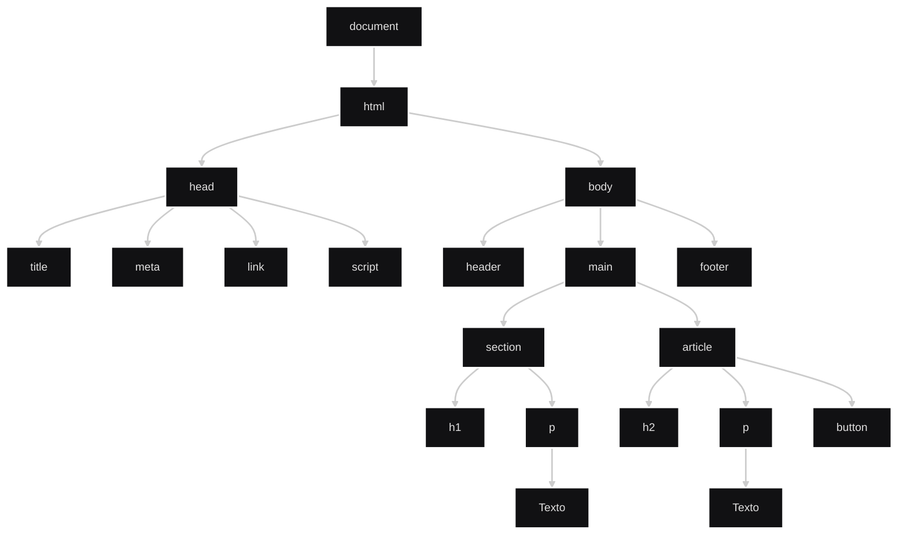
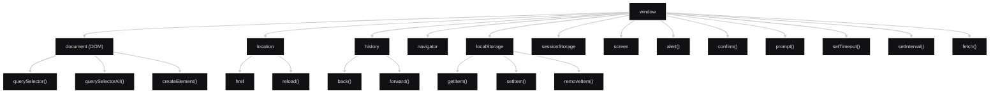

<br><br>

### Table of Contents

<br>

[Introducción](#introducción)

[Render](#render)

[Inspector](#inspector)

[El DOM](#el-dom)
- [Estructura del DOM](#estructura-del-dom)

[El BOM](#el-bom)
- [Estructura del BOM](#estructura-del-bom)

<br>

[Acciones vs Eventos](#acciones-vs-eventos)
- [Ejemplos para entender la relación](#ejemplos-para-entender-la-relación)
  - [Ejemplo 1](#ejemplo-1)
  - [Ejemplo 2](#ejemplo-2)
  - [Ejemplo 3](#ejemplo-3)
  - [Ejemplo 4](#ejemplo-4)
  - [Ejemplo 5](#ejemplo-5)
  - [Ejemplo 6](#ejemplo-6)

<br>
 
---

<br>

## Introducción

<br>

El frontend estático está compuesto por HTML y CSS, que definen la estructura y apariencia inicial de la página.

Es decir, sin JavaScript, una página web es completamente estática e incapaz de modificarse una vez cargada.

<br>

Cuando se necesita que la página cambie o responda a acciones del usuario, entra en juego JavaScript.

Sin embargo, JavaScript no interactúa directamente con el HTML y el CSS. En su lugar, utiliza el DOM (Document Object Model) para representar el documento HTML y el BOM (Browser Object Model) para representar el navegador.

A través de estas representaciones puede leer, crear, modificar o eliminar elementos de la página, así como acceder a distintas funcionalidades del navegador.

<br>

Por lo tanto, el frontend sigue siendo estático porque los archivos HTML, CSS y JavaScript servidos por el servidor ya existen y no se generan dinámicamente. No obstante, la página puede comportarse de forma dinámica gracias a JavaScript, que responde a eventos y ejecuta acciones que modifican el contenido y comportamiento de la página.

<br><br>

---

<br>

## Render

<br>

Existen dos formas principales de generar el contenido de una página web: SSR (Server-Side Rendering) y CSR (Client-Side Rendering).

En SSR, el servidor genera el HTML dinámicamente antes de enviarlo al navegador. Tecnologías como PHP, Django, Ruby on Rails o Express con plantillas (EJS, Pug) suelen utilizar este enfoque.

En CSR, el servidor envía archivos estáticos de HTML, CSS y JavaScript. Luego, JavaScript solicita datos al backend y utiliza el DOM para construir o modificar el contenido de la página. Tecnologías como React, Vue, Angular o incluso JavaScript puro con fetch() suelen utilizar este enfoque.

Por lo tanto, en un frontend estático con CSR, los archivos HTML, CSS y JavaScript no cambian, pero la página puede comportarse de forma dinámica gracias a JavaScript y al DOM.

<br><br>

---

<br>

## Inspector

<br>

Las herramientas de desarrollador son un conjunto de utilidades integradas en el navegador que permiten inspeccionar, analizar y modificar una página web mientras se está ejecutando.

Las modificaciones realizadas desde las herramientas de desarrollador son temporales, es decir, al recargar la página los cambios se pierden. 
Por eso, se utilizan para testear y ver qué está pasando dentro de una página web mientras funciona y no para desarrollar algo en sí.

<br>

Permiten:

- Ver y modificar temporalmente el HTML de la página.
- Ver y modificar temporalmente el CSS.
- Ejecutar código JavaScript.
- Visualizar errores y mensajes de la aplicación.
- Analizar requests y responses HTTP.
- Depurar (*debuggear*) código.
- Inspeccionar elementos del DOM.

<br><br>

### Cómo usarlo

<br>

1. Crear un archivo HTML con una etiqueta `<script>`.
2. Abrir el archivo en el navegador.
3. Abrir las herramientas de desarrollador:
   - Click derecho → **Inspeccionar**
   - O presionar `F12`
4. Ir a la pestaña deseada:

<br>


| Pestaña      | ¿Qué muestra?     | Información típica                                                    | ¿Para qué sirve?                                                               | Ejemplos                                                         |
| ------------ | ----------------- | --------------------------------------------------------------------- | ------------------------------------------------------------------------------ | ---------------------------------------------------------------- |
| **Elements** | HTML y CSS        | Etiquetas, atributos, clases, IDs, estilos aplicados                  | Inspeccionar y modificar temporalmente la estructura y apariencia de la página | Ver un `<button>`, cambiar un color, agregar una clase CSS       |
| **Console**  | JavaScript        | Logs, errores, warnings, variables, resultados de expresiones         | Ejecutar código, depurar y verificar resultados                                | `console.log()`, `document.querySelector()`, errores de sintaxis |
| **Network**  | Comunicación HTTP | Requests, responses, headers, body, tiempo de respuesta, códigos HTTP | Analizar cómo se comunica la aplicación con APIs y servidores                  | Ver un `GET`, inspeccionar un JSON, detectar un `404`            |
| **Sources**  | Archivos cargados | HTML, CSS, JS, imágenes y mapas de código                             | Leer código y depurar con breakpoints                                          | Pausar la ejecución, inspeccionar variables paso a paso          |

<br><br>

---

<br>

## El DOM

<br>

El DOM (Document Object Model) representa el HTML como una estructura de objetos manipulable desde JavaScript. <br>
El DOM es la representación del HTML que el navegador crea en memoria para que JavaScript pueda leerlo y modificarlo.

<br>

```html
<body>
    <h1 id="titulo">Hola</h1>
    <button class="btn">Click</button>
</body>
```

<br>

Se transforma internamente en algo parecido a:

<br>

```txt
document
└─ html
   └─ body
      ├─ h1#titulo
      └─ button.btn
```

<br>

JavaScript busca elementos dentro de ese árbol, ejemplo:

<br>

```js
const titulo = document.getElementById("titulo");
const boton = document.querySelector(".btn");
```

<br>

Y puede modificarlos:

<br>

```js
titulo.textContent = "Texto cambiado";
```

<br>

Resultado:

<br>

```html
<h1 id="titulo">Texto cambiado</h1>
```

<br>

Flujo: 

<br>

```txt
HTML
↓
El navegador crea el DOM
↓
Usuario interactúa
↓
JavaScript recibe el evento
↓
JavaScript busca y modifica elementos del DOM
↓
El navegador actualiza la pantalla
```

<br><br>

### Estructura del DOM

<br>



<br>

---

<br>

## El BOM

<br>

El Browser Object Model (BOM) es el conjunto de objetos que representan al navegador y permiten a JavaScript interactuar con sus funcionalidades.

A través del BOM, JavaScript puede acceder y controlar aspectos del navegador como:

- La ventana (window)
- La URL actual (location)
- El historial de navegación (history)
- El almacenamiento local (localStorage)
- Los temporizadores (setTimeout, setInterval)
- Los cuadros de diálogo (alert, confirm, prompt)

<br><br>

### Estructura del BOM

<br>



<br><br>

---

<br>

## Acciones vs Eventos

<br>

Un evento es una notificación de que ocurrió algo relevante durante la ejecución de la página.
- Eventos del usuario: son provocados por el usuario (como un click en un botón)
- Eventos del navegador: son provocados por el propio navegador (como la carga de la página o un cambio en el tamaño de la ventana). 
→ El desarrollador debe definir qué eventos necesita que JavaScript escuche (es decir, que esté esperando que sucedan) para ejecutar determinadas acciones. `addEventListener()` registra una función (que contiene la acción) que se ejecutará cuando ocurra el evento determinado por el desarrollador.

<br>
 
Una acción es una tarea que JavaScript ejecuta (por ejemplo: cambiar un texto, crear un elemento o mostrar un mensaje).
- Como respuesta a un evento (si se definió un evento a escuchar).
- O por decisión propia (se ejecutan porque el programador decidió que se ejecuten pero no en respuesta a un evento).

<br><br><br>

```txt
JavaScript
├─ DOM
│  ├─ Acciones: Manipulación del DOM
│  │  ├─ Seleccionar elementos
│  │  ├─ Modificar contenido
│  │  ├─ Crear elementos
│  │  └─ Eliminar elementos
│  │
│  └─ Eventos DOM
│     ├─ click
│     ├─ input
│     ├─ submit
│     ├─ keydown
│     └─ mouseover
│
└─ BOM
   ├─ Acciones: Manipulación del BOM
   │  ├─ location
   │  ├─ localStorage
   │  ├─ setTimeout
   │  ├─ setinterval
   │  └─ alert
   │
   └─ Eventos BOM
      ├─ load
      ├─ resize
      ├─ beforeunload
      ├─ online
      └─ offline
```

<br><br><br>

### Ejemplos para entender la relación

<br><br>

#### Ejemplo 1

Evento DOM → Acción DOM
click → cambiar texto

<br>

```html
<!DOCTYPE html>
<html>
<body>

    <h1>Bienvenido</h1>

    <button id="saludar">
        Cambiar texto
    </button>

    
    <script>

      const button = document.querySelector("#saludar");
      const titulo = document.querySelector("h1");
      
      button.addEventListener("click", () => {
          titulo.textContent = "Hola";
      });

    </script>

</body>
</html>
```

<br>

#### Ejemplo 2

Evento DOM → Acción BOM
click → recargar página

<br>

```html
<!DOCTYPE html>
<html>
<body>

    <h1>Bienvenido</h1>

    <button id="recargar">
        Recargar la página
    </button>

    
    <script>

      const button = document.querySelector("#recargar");

      button.addEventListener("click", () => {
          location.reload();
      });

    </script>

</body>
</html>
```

<br>

#### Ejemplo 3

Evento BOM → Acción DOM
load → cambiar texto

<br>

<br>

```html
<!DOCTYPE html>
<html>
<body>

    <h1 id="titulo">Bienvenido</h1>
    
    <script>

      const titulo = document.querySelector("#titulo");

      window.addEventListener("load", () => {
          titulo.textContent = "Hola";
      });

    </script>

</body>
</html>
```

<br>

#### Ejemplo 4

Evento BOM → Acción BOM
resize → guardar dato

<br>

En cualquier lugar del body del HTML, dentro de las etiquetas `<script>`.

<br>

```js
window.addEventListener("resize", () => {
    localStorage.setItem("ancho", window.innerWidth);
});
```

<br>

#### Ejemplo 5

Sin evento → Acción DOM
ejecución del script → cambiar texto

<br>

```html
<!DOCTYPE html>
<html>
<body>

    <h1>Bienvenido</h1>
    
    <script>

      // Forma 1 de escribirlo
      document.querySelector("h1").textContent = "Hola";
      
      // Forma 2 de escribirlo
      document
        .querySelector("h1")
        .textContent = "Hola";
      
      // Forma 3 de escribirlo
      const titulo = document.querySelector("h1");
      
      titulo.textContent = "Hola";

    </script>

</body>
</html>
```

<br>

#### Ejemplo 6

Sin evento → Acción BOM
ejecución del script → alert()

<br>

En cualquier lugar del body del HTML, dentro de las etiquetas `<script>`.

<br>

```js
alert("Bienvenido");
```

<br><br><br>
