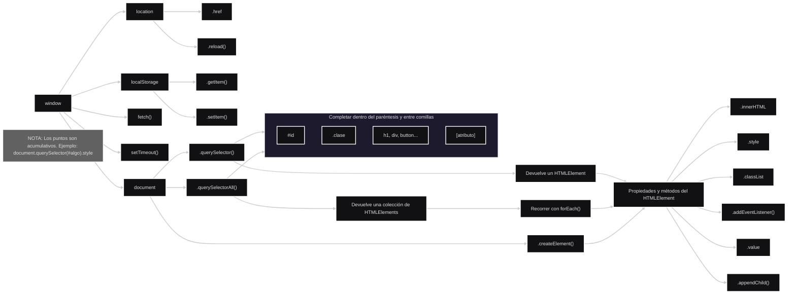

<br><br>

### Table of Contents

<br>

- [Diagrama](#diagrama)
- [Acciones BOM](#acciones-bom)
- [Eventos BOM](#eventos-bom)
- [Acciones DOM](#acciones-dom)
- [Eventos DOM](#eventos-dom)
- [Validaciones Típicas](#validaciones-típicas)
- [Extra: tablas](#extra-tablas)
- [Ejemplos Vistos en Clase](#ejemplos-vistos-en-clase)
  - [To-do List](#1-to-do-list-crear-elementos-hijos-dinámicamente)
  - [Botón cambiador de estilos](#2-botón-cambiador-de-estilos)
  - [Plantilla forEach](#3-plantilla-foreach) 

<br><br>

---

<br>

## Diagrama

<br>



<br><br><br><br>

## Acciones BOM

<br>

```js
// =====================
// MENSAJES Y DIÁLOGOS
// =====================

// Mostrar un mensaje
window.alert("Hola");

// Mostrar un mensaje con opciones Aceptar / Cancelar
window.confirm("¿Desea continuar?");

// Solicitar un dato al usuario
window.prompt("Ingrese su nombre");


// =====================
// NAVEGACIÓN
// =====================

// Recargar la página actual
window.location.reload();

// Ir a otra URL
window.location.href = "https://www.google.com";


// =====================
// ALMACENAMIENTO LOCAL
// =====================

// Guardar un dato
localStorage.setItem("nombre", "Ingrid");

// Obtener un dato
localStorage.getItem("nombre");

// Eliminar un dato
localStorage.removeItem("nombre");

// Borrar todo el almacenamiento local
localStorage.clear();


// =====================
// TEMPORIZADORES
// =====================

// Ejecutar una vez después de un tiempo
setTimeout(() => {
    console.log("Hola");
}, 3000);

// Ejecutar repetidamente cada cierto tiempo
setInterval(() => {
    console.log("Hola");
}, 3000);


// =====================
// CONTROL DE TEMPORIZADORES
// =====================

// Detener un setTimeout
const timeoutId = setTimeout(() => {
    console.log("Hola");
}, 3000);

clearTimeout(timeoutId);


// Detener un setInterval
const intervalId = setInterval(() => {
    console.log("Hola");
}, 3000);

clearInterval(intervalId);
```

<br><br><br><br>

## Eventos BOM

<br>

```js
// =====================
// EVENTOS DE CARGA
// =====================

// La página terminó de cargar
window.addEventListener("load", () => {
    console.log("Página cargada");
});


// =====================
// EVENTOS DE VENTANA
// =====================

// El usuario cambia el tamaño de la ventana
window.addEventListener("resize", () => {
    console.log("Nuevo tamaño");
});

// El usuario intenta cerrar o recargar la página
window.addEventListener("beforeunload", () => {
    console.log("La página se va a cerrar");
});


// =====================
// EVENTOS DE NAVEGACIÓN
// =====================

// El usuario navega hacia atrás o adelante
window.addEventListener("popstate", () => {
    console.log("Se navegó hacia atrás o adelante");
});


// =====================
// EVENTOS DE CONECTIVIDAD
// =====================

// Se recupera la conexión a Internet
window.addEventListener("online", () => {
    console.log("Conectado");
});

// Se pierde la conexión a Internet
window.addEventListener("offline", () => {
    console.log("Sin conexión");
});
```

<br><br><br><br>

## Acciones DOM

<br>

```js
// =====================
// LEER INFORMACIÓN
// Obtener contenido, atributos o elementos
// =====================

document.querySelector("#titulo");
document.querySelectorAll(".tarjeta");
document.getElementById("titulo");

element.textContent;
element.innerHTML;
element.value;
element.getAttribute("src");


// =====================
// MODIFICAR INFORMACIÓN
// Cambiar contenido o atributos
// =====================

element.textContent = "Hola";
element.innerHTML = "<b>Hola</b>";
element.value = "Juan";
element.setAttribute("src", "imagen.png");


// =====================
// MODIFICAR ESTILOS
// Cambiar la apariencia
// =====================

element.style["color"] = "red";                 // element.style.color = "red";
element.style["display"] = "none";              // element.style.display = "none";
element.style["font-size"] = "40px";            // element.style.fontSize = "40px";
element.style["background-color"] = "black";    // element.style.backgroundColor = "black";


// =====================
// MODIFICAR CLASES
// Agregar o quitar clases CSS
// =====================

element.classList.add("activo");
element.classList.remove("activo");
element.classList.toggle("activo");


// =====================
// CREAR ELEMENTOS
// Generar nuevos nodos
// =====================

const p = document.createElement("p");


// =====================
// INSERTAR ELEMENTOS
// Agregar elementos al documento
// =====================

padre.appendChild(p);
padre.prepend(p);


// =====================
// ELIMINAR ELEMENTOS
// Borrar elementos existentes
// =====================

element.remove();


// =====================
// RECORRER EL DOM
// Navegar entre elementos relacionados
// =====================

// Padre
element.parentElement;

// Hijos
element.children;
element.firstElementChild;
element.lastElementChild;
element.childElementCount;

// Hermanos
element.nextElementSibling;
element.previousElementSibling;

// Ancestros
element.closest(".contenedor");

// Descendientes
element.querySelector("button");
element.querySelectorAll("p");
```

<br><br><br><br>

## Eventos DOM

<br>

```js
// =====================
// EVENTOS DE MOUSE
// =====================

// Click
element.addEventListener("click", () => {
    console.log("Click");
});

// Doble click
element.addEventListener("dblclick", () => {
    console.log("Doble click");
});

// El mouse entra al elemento
element.addEventListener("mouseenter", () => {
    console.log("Entró el mouse");
});

// El mouse sale del elemento
element.addEventListener("mouseleave", () => {
    console.log("Salió el mouse");
});


// =====================
// EVENTOS DE TECLADO
// =====================

// Se presiona una tecla
element.addEventListener("keydown", () => {
    console.log("Tecla presionada");
});

// Se libera una tecla
element.addEventListener("keyup", () => {
    console.log("Tecla liberada");
});


// =====================
// EVENTOS DE INPUTS
// =====================

// Cambia el contenido del input
element.addEventListener("input", () => {
    console.log("Input modificado");
});

// El input pierde el foco
element.addEventListener("blur", () => {
    console.log("Perdió el foco");
});

// El input recibe el foco
element.addEventListener("focus", () => {
    console.log("Recibió el foco");
});


// =====================
// EVENTOS DE FORMULARIOS
// =====================

// Se intenta enviar un formulario
element.addEventListener("submit", (event) => {
    event.preventDefault();
    console.log("Formulario enviado");
});


// =====================
// EVENTOS DE SELECCIÓN
// =====================

// Cambia una selección
element.addEventListener("change", () => {
    console.log("Valor cambiado");
});
```

<br><br><br><br>

## Validaciones Típicas

<br>

```js
// =====================
// CAMPO OBLIGATORIO
// =====================

if (input.value === "") {
    error.textContent = "Este campo es obligatorio";
}


// =====================
// LONGITUD MÍNIMA
// =====================

if (input.value.length < 3) {
    error.textContent = "Debe tener al menos 3 caracteres";
}


// =====================
// LONGITUD MÁXIMA
// =====================

if (input.value.length > 50) {
    error.textContent = "No puede superar los 50 caracteres";
}


// =====================
// SOLO NÚMEROS
// =====================

if (isNaN(input.value)) {
    error.textContent = "Debe ingresar un número";
}


// =====================
// MAYOR DE EDAD
// =====================

if (Number(input.value) < 18) {
    error.textContent = "Debe ser mayor de edad";
}


// =====================
// RANGO NUMÉRICO
// =====================

const nota = Number(input.value);

if (nota < 0 || nota > 10) {
    error.textContent = "La nota debe estar entre 0 y 10";
}


// =====================
// EMAIL
// =====================

if (!input.value.includes("@")) {
    error.textContent = "Email inválido";
}


// =====================
// CONTRASEÑA MÍNIMA
// =====================

if (password.value.length < 8) {
    error.textContent =
        "La contraseña debe tener al menos 8 caracteres";
}


// =====================
// CONFIRMAR CONTRASEÑA
// =====================

if (password.value !== confirmacion.value) {
    error.textContent =
        "Las contraseñas no coinciden";
}


// =====================
// CHECKBOX OBLIGATORIO
// =====================

if (!checkbox.checked) {
    error.textContent =
        "Debe aceptar los términos y condiciones";
}


// =====================
// SELECT OBLIGATORIO
// =====================

if (select.value === "") {
    error.textContent =
        "Debe seleccionar una opción";
}


// =====================
// EVITAR ENVÍO DEL FORMULARIO
// =====================

formulario.addEventListener("submit", (event) => {

    event.preventDefault();

    if (input.value === "") {
        error.textContent =
            "Complete todos los campos";
        return;
    }

    console.log("Formulario válido");

});


// =====================
// MOSTRAR / OCULTAR ERROR
// =====================

if (input.value === "") {

    error.textContent =
        "Campo obligatorio";

    input.classList.add("error");

} else {

    error.textContent = "";

    input.classList.remove("error");

}
```

<br><br><br><br>


## Extra: tablaa

<br>

```html
<table>
    <tbody id="tabla-usuarios">
    </tbody>
</table>
```

<br>

```js
// =====================
// LEER INFORMACIÓN
// =====================

// Seleccionar una celda
const celda = document.querySelector("td");

console.log(celda.textContent);

// Seleccionar todas las filas
const filas = document.querySelectorAll("tr");


// =====================
// MODIFICAR INFORMACIÓN
// =====================

// Cambiar el contenido de una celda
celda.textContent = "20";

// Reemplazar el contenido de una fila
const fila = document.querySelector("tr");

fila.innerHTML = `
    <td>Juan</td>
    <td>25</td>
`;


// =====================
// CREAR FILAS
// =====================

const nuevaFila = document.createElement("tr");

nuevaFila.innerHTML = `
    <td>Juan</td>
    <td>19</td>
`;

const tabla =
    document.querySelector("#tabla-usuarios");

tabla.appendChild(nuevaFila);


// =====================
// CREAR CELDAS MANUALMENTE
// =====================

const filaManual = document.createElement("tr");

const nombre = document.createElement("td");
nombre.textContent = "Juan";

const edad = document.createElement("td");
edad.textContent = "19";

filaManual.appendChild(nombre);
filaManual.appendChild(edad);

tabla.appendChild(filaManual);


// =====================
// ELIMINAR FILAS
// =====================

const filaAEliminar =
    document.querySelector("tr");

filaAEliminar.remove();


// =====================
// RECORRER FILAS
// =====================

const todasLasFilas =
    document.querySelectorAll("tr");

todasLasFilas.forEach((fila) => {

    console.log(fila.textContent);

});


// =====================
// GENERAR TABLA DESDE DATOS
// =====================

const usuarios = [
    { nombre: "Juan", edad: 19 },
    { nombre: "Ana", edad: 20 }
];

usuarios.forEach((usuario) => {

    const fila = document.createElement("tr");

    fila.innerHTML = `
        <td>${usuario.nombre}</td>
        <td>${usuario.edad}</td>
    `;

    tabla.appendChild(fila);

});
```

<br>

Resultado conceptual:

<br>

```html
<table>
    <tbody id="tabla-usuarios">

        <tr>
            <td>Juan</td>
            <td>19</td>
        </tr>

    </tbody>
</table>
```


<br><br><br><br>

## Ejemplos Vistos en Clase

<br>

### 1. To Do List: crear elementos hijos dinámicamente

<br>

```js
const addButton = document.querySelector("#addButton");
const listOfElements = document.querySelector("#todoList");
const elementInput = document.querySelector("#todoInput");

addButton.addEventListener("click", () => {

  // Obtiene el texto ingresado por el usuario.
  const textToAdd = elementInput.value;

  // Evita agregar tareas vacías.
  if (!textToAdd || textToAdd.length === 0) {
    alert("No podes agregar una tarea vacía");
    return;
  }

  // Crea:
  // <li></li>
  const newItem = document.createElement("li");

  // Inserta el texto dentro del elemento:
  //
  // <li>
  //   el texto
  // </li>
  newItem.innerHTML = textToAdd;

  // Agrega el elemento al final de la lista.
  listOfElements.appendChild(newItem);

  // Limpia el input.
  elementInput.value = "";

});
```

<br>

```txt
Usuario escribe texto
↓
Validar datos
↓
¿Es válido?
├─ Sí → Crear elemento
└─ No → Mostrar alerta
```

<br><br><br><br>

### 2. Botón cambiador de estilos

<br>

```html
<h1 id="textoACambiar">Hola chicos!</h1>

<button id="boton_cambiador">
  Cambiar el color
</button>

<script>
  const botonBuscado = document.querySelector("#boton_cambiador");
  const textoACambiar = document.querySelector("#textoACambiar");

  botonBuscado.addEventListener("click", () => {

    textoACambiar.style.color = "purple";
    textoACambiar.style["font-size"] = "40px";

  });
</script>
```

<br>

Otra forma:

<br>

```js
const botonBuscado = document.querySelector("#boton_cambiador");

botonBuscado.addEventListener("click", () => {

  // Crea:
  // <style></style>
  const nuevosEstilos = document.createElement("style");

  // Inserta CSS dentro de la etiqueta.
  nuevosEstilos.innerHTML = `
    h1 {
      color: red;
    }
  `;

  // Agrega la etiqueta al <head>.
  document.head.append(nuevosEstilos);

});
```

<br><br><br><br>

### 3. Plantilla forEach

<br>

```js
const botonBuscado = document.querySelector("#boton_cambiador");
const titulos = document.querySelectorAll("h1");

botonBuscado.addEventListener("click", () => {

  titulos.forEach((titulo) => {

    // la accion deseada

  });

});
```

<br><br><br><br>
