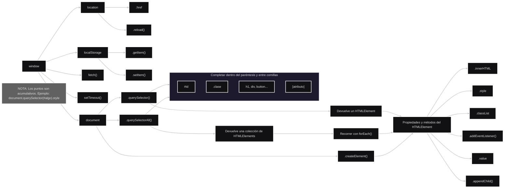

<br><br>

### Table of Contents

<br>

[Crear y eliminar elementos](#crear-y-eliminar-elementos)
- [createElement()](#createelement)
- [appendChild()](#appendchild)
- [prepend()](#prepend)
- [remove()](#remove)


<br>

[Validación de datos](#validación-de-datos)
- [inputs](#inputs)
- [formularios](#formularios)
- [preventDefault()](#preventdefault)
- [mensajes de error](#mensajes-de-error)
- [Ejemplo completo](#ejemplo-completo)

<br>

[Seleccionar y Manipular](#seleccionar-y-manipular)

- [Elemento Individual](#elemento-individual)
  - [textContent](#textcontent)
  - [innerHTML](#innerhtml)
  - [value](#value)
  - [atributos](#atributos)

- [Múltiples Elementos](#múltiples-elementos)

- [CSS](#css)
  - [Style](#style)
  - [classList](#classlist)

<br>

> [!NOTE]
> Las modificaciones de JavaScript afectan al DOM, no al archivo `.html` guardado en el proyecto. <br>
> Al recargar la página, el navegador vuelve a leer el HTML original y reconstruye el DOM desde cero.
>
> No obstante, puede resultar útil imaginar cómo quedaría el HTML si los cambios deseados se agregaran realmente al HTML.
> Aunque no es así como funciona internamente, esta simplificación ayuda a comprender el cambio realizado.
> Por esto, hay secciones que dicen "resultado conceptual".

<br>

---

<br>

## Crear y eliminar elementos

<br>

### createElement

<br>

Crea un nuevo elemento del DOM.

<br>

```js
const parrafo = document.createElement("p");
```

<br>

Todavía no aparece en la página.

<br>

```txt
DOM
↓
Se crea un elemento <p>
↓
No está insertado en ningún lugar.
Se debe insertar como hijo (con appendChild o prepend) de alguna etiqueta (body u otras).
```

<br><br><br>

### appendChild

<br>

Agrega un elemento como último hijo de otro elemento.

<br>

```html
<body>
</body>
```

<br>

```js
const parrafo = document.createElement("p");

parrafo.textContent = "Hola";

document.body.appendChild(parrafo);
```

<br>

Resultado conceptual:

<br>

```html
<body>
    <p>Hola</p>
</body>
```

<br><br><br>

### prepend

<br>

Agrega un elemento como primer hijo.

<br>

```html
<body>
    <h1>Título</h1>
</body>
```

<br>

```js
const parrafo = document.createElement("p");

parrafo.textContent = "Hola";

document.body.prepend(parrafo);
```

<br>

Resultado conceptual:

<br>

```html
<body>
    <p>Hola</p>
    <h1>Título</h1>
</body>
```

<br><br><br>

### remove

<br>

Elimina un elemento.

<br>

```html
<h1 id="titulo">Hola</h1>
```

<br>

```js
const titulo = document.querySelector("#titulo");

titulo.remove();
```

<br><br><br>

---

<br>

## Validación de datos

<br>

La validación consiste en verificar que los datos ingresados por el usuario sean correctos antes de utilizarlos.

Ejemplos:

<br>

```txt
Campo obligatorio
Edad mayor a 18
Email válido
Contraseña con longitud mínima
```

<br><br><br>

### inputs

<br>

Los datos suelen ingresarse mediante inputs.

<br>

```html
<input id="nombre">
```

<br>

```js
const input = document.querySelector("#nombre");

console.log(input.value);
```

<br>

Si el usuario escribiera `Juan`, entonces `input.value` valdría `"Juan"`

<br><br><br>

### formularios

<br>

Los formularios agrupan varios campos y suelen enviarse al servidor.

<br>

```html
<form>
    <input id="nombre">
    <button>Enviar</button>
</form>
```

<br>

Cuando se presiona el botón, el formulario intenta enviarse.


<br><br><br>

### preventDefault

<br>

Evita el comportamiento por defecto del navegador.

<br>

```html
<form id="formulario">
    <input id="nombre">
    <button>Enviar</button>
</form>
```

<br>

```js
const formulario = document.querySelector("#formulario");

formulario.addEventListener("submit", (event) => {
    event.preventDefault();

    console.log("Formulario validado");
});
```

<br>

Sin él, el navegador intentaría enviar el formulario y recargar la página. <br>
Usándolo, el desarrollador decide qué hacer.

<br><br><br>

### mensajes de error

<br>

Permiten informar al usuario cuando un dato es inválido.

<br>

```html
<form id="formulario">
    <input id="nombre">
    <p id="error"></p>
</form>
```

<br>

```js
const input = document.querySelector("#nombre");
const error = document.querySelector("#error");

if (input.value === "") {
    error.textContent = "El nombre es obligatorio";
}
```

<br>

Resultado conceptual:

<br>

```txt
El nombre es obligatorio
```

<br><br><br>

### Ejemplo completo

<br>

```html
<form id="formulario">
    <input id="nombre">
    <button>Enviar</button>
    <p id="error"></p>
</form>
```

<br>

```js
const formulario = document.querySelector("#formulario");
const input = document.querySelector("#nombre");
const error = document.querySelector("#error");

formulario.addEventListener("submit", (event) => {

    event.preventDefault();

    if (input.value === "") {
        error.textContent = "El nombre es obligatorio";
        return;
    }

    error.textContent = "";
    console.log("Formulario válido");

});
```

<br>

Flujo:

<br>

```txt
submit
↓ Evento DOM

preventDefault()
↓ Evitar envío

Validar input.value
↓
Mostrar error o continuar
↓
Acción DOM
```

<br><br><br>


<br>

## Seleccionar y Manipular

<br>



<br>

### Elemento Individual

<br>

- `querySelector()` selecciona el primer elemento que coincida con un selector HTML-CSS.

<br>

```js
document.querySelector("h1");
document.querySelector("#titulo");
document.querySelector(".destacado");
```

<br><br>

#### textContent

Lee o modifica únicamente el texto de un elemento.

<br>

```js
titulo.textContent = "Hola";
``` 

<br>

Resultado conceptual:

<br>

```html
<h1>Hola</h1>
```

<br><br><br>

#### innerHTML

Lee o modifica el contenido HTML interno.

<br>

```js
titulo.innerHTML = "<b>Hola</b>";
```

<br>

Resultado conceptual:

<br>

```html
<h1><b>Hola</b></h1>
```

<br>

Importante:
- textContent trata todo como texto.
- innerHTML interpreta etiquetas HTML.

<br><br><br>

#### value

Lee o modifica el valor de inputs, textareas y selects.

<br>

```html
<input id="nombre">
```

```js
const input = document.querySelector("#nombre");

console.log(input.value);
```

<br>

Si el usuario escribiera `Juan`, `input.value` valdría `"Juan"`

<br><br><br>

#### atributos

Permiten leer o modificar propiedades HTML.

<br>

```html

```

```js
const foto = document.querySelector("#foto");

// Forma 1 de escribirlo
foto.setAttribute("src", "nueva.jpg");

// Forma 2 de escribirlo
foto.src = "nueva.jpg";
```

<br><br><br>

### Múltiples Elementos

<br>

Supongamos tener:

<br>

```html
<p>Uno</p>
<p>Dos</p>
<p>Tres</p>
```

<br>

y se desea reemplazar el contenido de los parrafos por "Hola".
- Se recurre a JavaScript:

<br>

`querySelectorAll()` selecciona todos los elementos que coincidan

<br>

```js
const parrafos = document.querySelectorAll("p");
```

<br>

Pero `querySelectorAll()` los devuelve en un `NodeList` (colección de elementos del DOM):

<br>

```txt
NodeList
├─ p[0]
├─ p[1]
└─ p[2]
```

<br>

Entonces se debe recurrir a `forEach()` para recorrer cada elemento y así aplicar cambios.

<br>

```js
const parrafos = document.querySelectorAll("p");

parrafos.forEach((parrafo) => {
    // En este ejemplo se cambia el contenido de todos los parrafos a "Hola"
    parrafo.textContent = "Hola";
});
```

<br>

Resultado conceptual de lo que sería el HTML:

<br>

```html
<p>Hola</p>
<p>Hola</p>
<p>Hola</p>
```

<br><br><br>

---

<br>

## CSS

<br>

- Se suele utilizar la opción `style` para cambios muy puntuales o pequeños al elemento,
- mientras que la opción `classList` resulta más práctica y prolija para cambios grandes que se consideran reutilizar en otros elementos.

<br><br><br>

### Style

<br>

Supongamos tener:

<br>

```html
<h1 id="titulo">Hola</h1>
```

<br>

```js
const titulo = document.querySelector("h1");

// Forma 1 de escribirlo
titulo.style.color = "red";
titulo.style.fontSize = "40px";
titulo.style.backgroundColor = "black";

// Forma 2 de escribirlo
titulo.style["color"] = "red";                 
titulo.style["font-size"] = "40px";             
titulo.style["background-color"] = "black";   
```

<br>

Si se usara alguna de esas 2 opciones, el HTML cambiaría conceptualmente a:

<br>

```html
<h1
    id="titulo"
    style="
        color: red;
        font-size: 40px;
        background-color: black;
    "
>
    Hola
</h1>
<br>
```

<br><br><br>

### classList

<br>

Supongamos tener:

<br>

```html
<h1 id="titulo">Hola</h1>
```

<br>

```css
.destacado {
    color: red;
    font-size: 40px;
}
```

<br>

```js
const titulo = document.querySelector("#titulo");

// Agrega la clase al elemento seleccionado
titulo.classList.add("destacado");

// Quita la clase al elemento seleccionado
titulo.classList.remove("destacado");

// Si la clase no existe, la agrega al elemento seleccionado. Si existe, se la quita.
titulo.classList.toggle("destacado");
```

<br>

Si se usara `classList.add("destacado")`, el HTML cambiaría conceptualmente a:

<br>

```html
<h1 id="titulo" class="destacado">Hola</h1>
```

<br>

Y como ahora tiene la clase `destacado`, se aplican los estilos CSS de esa clase al elemento seleccionado.

<br>
