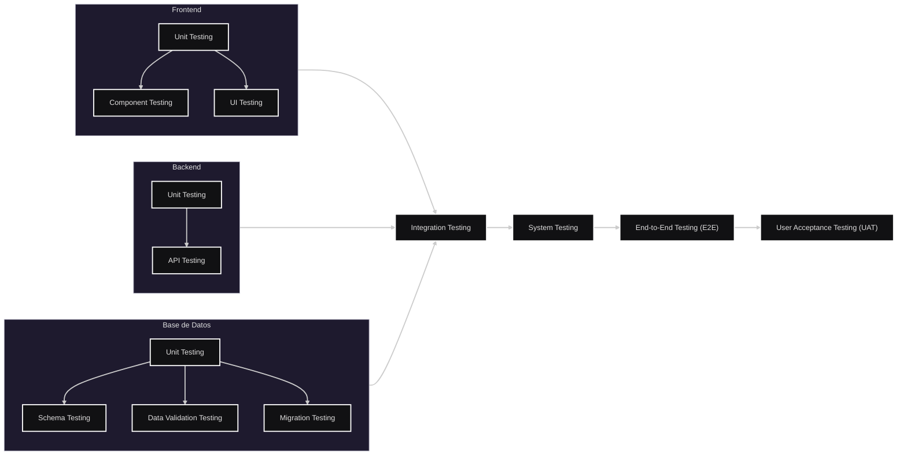

<br>

### Table of Contents

<br>

[Teoría](#Teoría)
- [Niveles de Testeo](#Niveles-de-Testeo)
- [Los Tests](#Los-Tests)
- [Orden y Capas](#Orden-y-Capas)

<br>

[Cómo Hacerlos *](#Cómo-Hacerlos)

<br>

`* Los ejemplos son orientativos; incluir todos los casos sería imposible.`

<br>

---

<br>

## Teoría

<br>

### Niveles de Testeo

<br>

| Nivel | Qué prueba |
|---------|---------|
| **1. Unit Testing** | La unidad más pequeña de código de forma aislada (función, método, clase o componente). |
| **2. Integration Testing** | La comunicación e interacción entre múltiples módulos, servicios o capas. |
| **3. System Testing** | El comportamiento del sistema completo como una única aplicación integrada, verificando que todos sus componentes funcionen correctamente en conjunto. |
| **4. End-to-End (E2E) Testing** | Flujos reales de usuario atravesando todas las capas del sistema. |
| **5. User Acceptance Testing (UAT)** | Que el sistema cumpla los requisitos funcionales y expectativas del usuario o cliente. |


<br><br><br><br>


### Los Tests

<br>

```txt
Nivel 1 - Unit Testing
├─ Component Testing
├─ API Testing*
├─ Schema Testing
├─ Data Validation Testing
└─ Migration Testing*

Nivel 2 - Integration Testing
├─ Frontend ↔ Backend
├─ Backend ↔ DB
└─ Servicio ↔ Servicio

Nivel 3 - System Testing

Nivel 4 - End-to-End (E2E) Testing

Nivel 5 - User Acceptance Testing (UAT)

---

* API Testing puede ser Nivel 1 si testeás un endpoint aislado con mocks, pero puede ser Nivel 2 si el endpoint realmente habla con servicios o la DB.
* Migration Testing puede ser Nivel 1 si solo verificás que una migración corre, o puede ser Nivel 2 si además comprobás cómo interactúa con una base real y datos existentes.
```

<br><br>

| Nombre                         | Qué prueba                                                        |
| ------------------------------ | ----------------------------------------------------------------- |
| **Component Testing**          | Un componente de interfaz de forma aislada.                       |
| **API Testing**                | Endpoints, requests, responses, validaciones y códigos de estado. |
| **Schema Testing**             | Tablas, columnas, relaciones, índices y estructura general.       |
| **Data Validation Testing**    | Constraints, claves, tipos de datos y reglas de integridad.       |
| **UI Testing**                 | Elementos visuales, navegación e interacción de la interfaz.      |
| **Migration Testing**          | Scripts de creación, actualización y migración de esquemas.       |


<br><br><br><br>


### Orden y Capas

<br>

>[!NOTE]
>El testing se realiza de forma progresiva, pero no siempre completamente secuencial: algunas pruebas pueden solaparse entre capas a medida que el sistema crece.

<br>



<br><br>

>[!NOTE]
>Los tests de unidad se hacen durante todo el desarrollo. <br>
>Los tests de integración aparecen cuando dos o más partes empiezan a comunicarse.  
>Los tests E2E y UAT se hacen cuando el sistema ya tiene flujos completos funcionando.

<br>

1. Unit Testing (Frontend y Backend)
2. Schema / Data Validation / Migration Testing (DB)
3. Integration Testing (Backend ↔ DB)
4. API Testing
5. Integration Testing (Frontend ↔ Backend)
6. System Testing
7. End-to-End Testing (E2E)
8. User Acceptance Testing (UAT)


<br><br>

[Volver a Table of Contents](#Table-of-Contents)

<br>

---

<br><br>

## Cómo Hacerlos

<br><br>

### Unit Testing

<br>

Se prueba una única pieza de código de forma aislada.

**Ejemplo:**

Tengo una función que calcula el precio final de una compra.

<br>

```js
calcularTotal(1000, 3)
```

<br>

Espero:

<br>

```text
3000
```

<br>

Solo estoy verificando esa función. No participan otras funciones, APIs, bases de datos ni interfaces.

<br>

**Pregunta que responde:**

> ¿Esta pieza de código funciona correctamente?

<br><br><br>

### Component Testing

<br>

Se prueba un componente visual aislado del resto de la aplicación.

**Ejemplo:**

Tengo un componente:

<br>

```text
[ Crear tarea ]
```

<br>

Verifico que:

* Se renderice correctamente.
* Muestre el texto esperado.
* Ejecute la acción correcta al hacer click.

<br>

No necesito backend ni base de datos.

<br>

**Pregunta que responde:**

> ¿Este componente funciona correctamente por sí solo?


<br><br><br>

### API Testing

<br>

Se prueba un endpoint del backend.

**Ejemplo:**

<br>

```http
POST /tasks
```

<br>

Envío:

<br>

```json
{
  "titulo": "Comprar leche"
}
```

<br>

Espero:

<br>

```http
201 Created
```

<br>

y una respuesta válida.

No me importa la interfaz gráfica.

<br>

**Pregunta que responde:**

> ¿Este endpoint responde correctamente?


<br><br><br>

### Schema Testing

<br>

Se prueba la estructura de la base de datos.

**Ejemplo:**

Verifico que exista:

<br>

```sql
tasks
```

<br>

y que tenga:

<br>

```sql
id
titulo
fecha_creacion
```

<br>

**Pregunta que responde:**

> ¿La base de datos tiene la estructura esperada?

<br><br><br>


### Data Validation Testing

<br>

Se prueban las reglas de integridad de los datos.

**Ejemplo:**

Intento guardar:

<br>

```sql
INSERT INTO tasks(titulo)
VALUES(NULL);
```

<br>

Espero un error porque:

<br>

```sql
titulo NOT NULL
```

<br>

**Pregunta que responde:**

> ¿La base de datos impide datos inválidos?

<br><br><br>

### Migration Testing

<br>

Se prueban los scripts que crean o modifican la base de datos.

**Ejemplo:**

Ejecuto:

<br>

```sql
init.sql
```

<br>

y verifico que todas las tablas se creen correctamente.

**Pregunta que responde:**

> ¿Puedo construir la base de datos desde cero sin errores?

<br><br><br>

### Integration Testing

<br>

Se prueba la comunicación entre distintas partes del sistema.

**Ejemplo:**

<br>

```text
Backend
↓
PostgreSQL
```

<br>

Creo una tarea usando el backend.

Luego verifico que la tarea se haya guardado en la base de datos.

<br>

**Pregunta que responde:**

> ¿Las distintas capas se comunican correctamente?

<br><br><br>

### System Testing

<br>

Se prueba la aplicación completa funcionando como un sistema integrado.

**Ejemplo:**

Levanto:

<br>

```text
Frontend
Backend
Base de Datos
```

<br>

y verifico que la aplicación funcione correctamente.

<br>

**Pregunta que responde:**

> ¿El sistema completo funciona?

<br><br><br>

### End-to-End Testing (E2E)

<br>

Se simula el comportamiento real de un usuario.

**Ejemplo:**

<br>

```text
Abrir la aplicación
↓
Iniciar sesión
↓
Crear tarea
↓
Editar tarea
↓
Eliminar tarea
```

<br>

Se recorren todas las capas del sistema.

<br>

**Pregunta que responde:**

> ¿Un usuario puede completar una tarea real de principio a fin?

<br><br><br>

### User Acceptance Testing (UAT)

<br>

Se valida que el producto cumpla los requisitos del usuario o cliente.

**Ejemplo:**

La consigna pide:

* Crear tareas
* Listar tareas
* Editar tareas
* Eliminar tareas

<br>

El usuario o docente prueba esas funcionalidades.

<br>

**Pregunta que responde:**

> ¿El producto cumple lo que se pidió?

<br>

```text
Función
↓
Componente
↓
Endpoint / Base de Datos
↓
Comunicación entre capas
↓
Sistema completo
↓
Flujo real de usuario
↓
Validación del cliente
```

<br><br><br>


