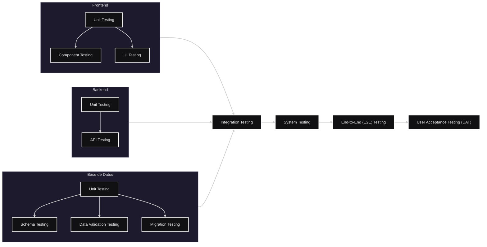

<br>

### Table of Contents

<br>

[Teoría](#Teoría)
- [Niveles de Testeo](#Niveles-de-Testeo)
- [Los Tests](#Los-Tests)
- [Orden y Capas](#Orden-y-Capas)

<br>

[Cómo Hacerlos](#Cómo-Hacerlos)


<br>

---

<br>

## Teoría

<br>

### Niveles de Testeo

<br>

| Nivel | Qué prueba |
|---------|---------|
| **1. Unit Testing** | La unidad más pequeña de código de forma aislada (función, método, clase o componente). |
| **2. Integration Testing** | La comunicación e interacción entre múltiples módulos, servicios o capas. |
| **3. System Testing** | El comportamiento del sistema completo como una única aplicación integrada, verificando que todos sus componentes funcionen correctamente en conjunto. |
| **4. End-to-End (E2E) Testing** | Flujos reales de usuario atravesando todas las capas del sistema. |
| **5. User Acceptance Testing (UAT)** | Que el sistema cumpla los requisitos funcionales y expectativas del usuario o cliente. |

<br><br>

>[!NOTE]
>En este caso, System Testing no es necesario porque con E2E Testing es suficiente.

<br><br><br><br>


### Los Tests

<br>

```txt
Nivel 1 - Unit Testing
├─ Component Testing
├─ API Testing*
├─ Schema Testing
├─ Data Validation Testing
└─ Migration Testing*

Nivel 2 - Integration Testing
├─ Frontend ↔ Backend
├─ Backend ↔ DB
└─ Servicio ↔ Servicio

(Nivel 3 - System Testing)

Nivel 4 - End-to-End (E2E) Testing

Nivel 5 - User Acceptance Testing (UAT)

---

* API Testing puede ser Nivel 1 si testeás un endpoint aislado con mocks, pero puede ser Nivel 2 si el endpoint realmente habla con servicios o la DB.
* Migration Testing puede ser Nivel 1 si solo verificás que una migración corre, o puede ser Nivel 2 si además comprobás cómo interactúa con una base real y datos existentes.
```

<br><br>

| Nombre                         | Qué prueba                                                        |
| ------------------------------ | ----------------------------------------------------------------- |
| **Component Testing**          | Un componente de interfaz de forma aislada.                       |
| **API Testing**                | Endpoints, requests, responses, validaciones y códigos de estado. |
| **Schema Testing**             | Tablas, columnas, relaciones, índices y estructura general.       |
| **Data Validation Testing**    | Constraints, claves, tipos de datos y reglas de integridad.       |
| **UI Testing**                 | Elementos visuales, navegación e interacción de la interfaz.      |
| **Migration Testing**          | Scripts de creación, actualización y migración de esquemas.       |


<br><br><br><br>


### Orden y Capas

<br>

>[!NOTE]
>El testing se realiza de forma progresiva, pero no siempre completamente secuencial: algunas pruebas pueden solaparse entre capas a medida que el sistema crece.

<br>



<br><br>

>[!NOTE]
>Los tests de unidad se hacen durante todo el desarrollo. <br>
>Los tests de integración aparecen cuando dos o más partes empiezan a comunicarse.  
>Los tests E2E y UAT se hacen cuando el sistema ya tiene flujos completos funcionando.

<br>

1. Unit Testing (Frontend y Backend)
2. Schema / Data Validation / Migration Testing (DB)
3. Integration Testing (Backend ↔ DB)
4. API Testing
5. Integration Testing (Frontend ↔ Backend)
6. End-to-End Testing (E2E)
7. User Acceptance Testing (UAT)


<br><br>

[Volver a Table of Contents](#Table-of-Contents)

<br>

---

<br><br>

## Cómo Hacerlos

<br>


